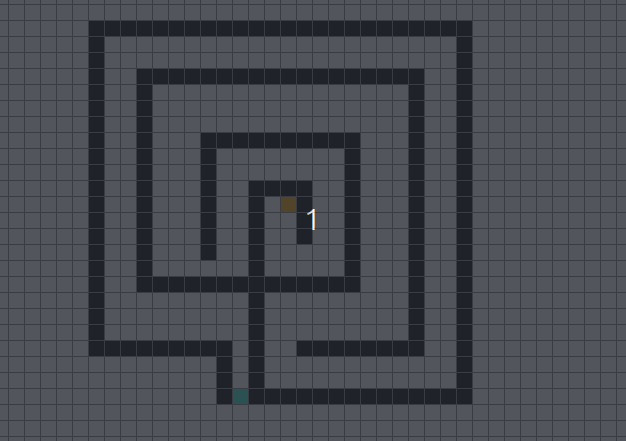

# maze solver

An interactive visualizer for the A* pathfinding algorithm built with Pygame.

## features
- step-by-step A* search with color-coded open and closed nodes
- draw barriers and place start/end points with mouse clicks
- left click any colored cell to erase it
- load maze images from a file dialog and auto-convert to a solvable grid
- animated shortest path reconstruction on success

## loading a maze
Press `I` to open a file dialog and select any maze image (PNG, JPG, BMP, etc.). The image is auto-cropped, converted to grayscale, and thresholded to separate walls from paths. After loading, click to place your start and end points then press `Space` to solve.

For best results use images with clear black walls and white paths.
